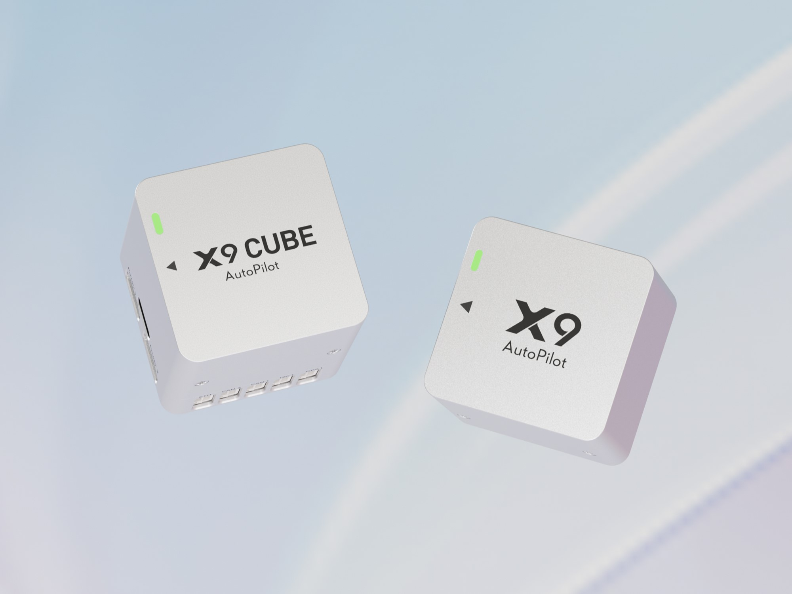
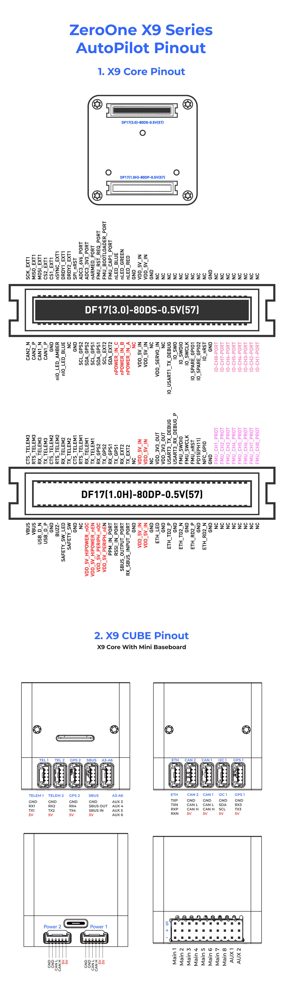

# ZeroOneX9 Series Flight Controller

The ZeroOne X9 is a series of flight controllers manufactured by ZeroOne, which is based on the open-source FMU v6X architecture and highly integrate all the features in smaller volume.

## Features

- Separate flight control core design.
- MCU

 STM32H753IIK6 32-bit processor running at 480MHz
 2MB Flash
 1MB RAM

- IO MCU

 STM32F103

- Sensors
 - IMU:

 Internal Vibration Isolation for IMUs
 IMU constant temperature heating(2W heating power).
 With Triple Synced IMUs, BalancedGyro technology, low noise and more shock-resistant:

 - **X9**:

 IMU1-IIM42652(With vibration isolation)
 IMU2-IIM42652(With vibration isolation)
 IMU3-IIM42652(No vibration isolation)

 - Baro:

 Two barometers: 2 x ICP20100 or BMP581+SPL06

 - Magnetometer:

 Builtin RM3100 magnetometer

## Pinout

## UART Mapping

The UARTs are marked Rn and Tn in the above pinouts. The Rn pin is the receive pin for UARTn. The Tn pin is the transmit pin for UARTn.

| Name | Function | MCU PINS | DMA |
| :-----: | :------: | :------: | :------:|
| SERIAL0 | OTG1 | USB | |
| SERIAL1 | Telem1 | UART7 | DMA Enabled |
| SERIAL2 | Telem2 | UART5 | DMA Enabled |
| SERIAL3 | GPS1 | USART1 | DMA Enabled |
| SERIAL4 | GPS2 | UART8 | DMA Enabled |
| SERIAL5 | Telem3 | USART2 | DMA Enabled |
| SERIAL6 | UART4 | UART4 | DMA Enabled |
| SERIAL7 | FMU DEBUG | USART3 | DMA Enabled |
| SERIAL8 | OTG-SLCAN | USB | |

## RC Input

The SBUS pin, can be used for all ArduPilot supported receiver protocols, except CRSF/ELRS and SRXL2 which require a true UART connection. However, FPort, when connected in this manner, will only provide RC without telemetry.
To allow CRSF and embedded telemetry available in Fport, CRSF, and SRXL2 receivers, a full UART, such as SERIAL6 (UART4) would need to be used for receiver connections. Below are setups using Serial6.

- [SERIAL6_PROTOCOL](https://ardupilot.org/copter/docs/parameters.html#serial6-protocol-serial6-protocol-selection) should be set to "23".
- FPort would require [SERIAL6_OPTIONS](https://ardupilot.org/copter/docs/parameters.html#serial6-options-serial6-options) be set to "15".
- CRSF/ELRS would require [SERIAL6_OPTIONS](https://ardupilot.org/copter/docs/parameters.html#serial6-options-serial6-options) be set to "0".
- SRXL2 would require [SERIAL6_OPTIONS](https://ardupilot.org/copter/docs/parameters.html#serial6-options-serial6-options) be set to "4" and connects only the TX pin.

Any UART can be used for RC system connections in ArduPilot also, and is compatible with all protocols except PPM. See [RC systems](https://ardupilot.org/copter/docs/common-rc-systems.html) for details.

## PWM Output

The X9 flight controller supports up to 16 PWM outputs.
First 8 outputs (labelled 1 to 8) are controlled by a dedicated STM32F103 IO controller.
The remaining 8 outputs (labelled 9 to 16) are the "auxiliary" outputs. These are directly attached to the STM32H753 FMU controller.
All 16 outputs support normal PWM output formats. All 16 outputs support DShot, except 15 and 16.

The 8 IO PWM outputs are in 3 groups:

- Outputs 1 and 2 in group1
- Outputs 3 and 4 in group2
- Outputs 5, 6, 7 and 8 in group3

The 8 FMU PWM outputs are in 3 groups:

- Outputs 1, 2, 3 and 4 in group1
- Outputs 5 and 6 in group2
- Outputs 7 and 8 in group3

Channels within the same group need to use the same output rate. If any channel in a group uses DShot then all channels in the group need to use DShot.

## GPIOs

All PWM outputs can be used as GPIOs (relays, camera, RPM etc). To use them you need to set the output’s SERVOx_FUNCTION to -1. The numbering of the GPIOs for PIN variables in ArduPilot is:

<table>
  <tr>
    <th colspan="3">IO Pins</th>
    <th colspan="1"> </th>
    <th colspan="3">FMU Pins</th>
  </tr>
  <tr><td> Name </td><td> Value </td><td> Option </td><td>  </td><td> Name </td><td> Value </td><td> Option </td></tr>
  <tr><td> M1 </td><td> 101 </td> <td> MainOut1 </td><td>  </td><td> M9 </td><td> 50 </td><td> AuxOut1 </td></tr>
  <tr><td> M2 </td><td> 102 </td> <td> MainOut2 </td><td>  </td><td> M10 </td><td> 51 </td><td> AuxOut2 </td></tr>
  <tr><td> M3 </td><td> 103 </td> <td> MainOut3 </td><td>  </td><td> M11 </td><td> 52 </td><td> AuxOut3 </td></tr>
  <tr><td> M4 </td><td> 104 </td> <td> MainOut4 </td><td>  </td><td> M12 </td><td> 53 </td><td> AuxOut4 </td></tr>
  <tr><td> M5 </td><td> 105 </td> <td> MainOut5 </td><td>  </td><td> M13 </td><td> 54 </td><td> AuxOut5 </td></tr>
  <tr><td> M6 </td><td> 106 </td> <td> MainOut6 </td><td>  </td><td> M14 </td><td> 55 </td><td> AuxOut6 </td></tr>
  <tr><td> M7 </td><td> 107 </td> <td> MainOut7 </td><td>  </td><td> M15 </td><td> 56 </td><td>  </td></tr>
  <tr><td> M8 </td><td> 108 </td> <td> MainOut8 </td><td>  </td><td> M16 </td><td> 57 </td><td>  </td></tr>
  <tr><td>  </td><td>  </td> <td>  </td><td>  </td><td> FCU CAP </td><td> 58 </td><td>  </td></tr>
</table>

## CAN

The X9 has two CAN buses. Both CAN ports are enabled by default (`CAN_P1_DRIVER` and `CAN_P2_DRIVER`).

## Ethernet

The X9 provides an RMII Ethernet interface with a LAN8742A PHY.

## Battery Monitoring

The X9 flight controller has two power connectors, supporting CAN interface power supply.
These are set by default in the firmware and shouldn't need to be adjusted.

## Compass

The X9 flight controller built-in industrial-grade electronic compass chip RM3100.

## Analog Inputs

The X9 flight controller has analog inputs:

- ADC Pin12 -> ADC 6.6V Sense
- ADC Pin13 -> ADC 3.3V Sense
- RSSI input pin = 103

## 5V PWM Voltage

The X9 flight controller supports switching between 5V and 3.3V PWM levels. Switch PWM output pulse level by configuring parameter BRD_PWM_VOL_SEL. 0 for 3.3V and 1 for 5V output.

## Loading Firmware

The board comes pre-installed with an ArduPilot compatible bootloader,
allowing the loading of xxxxxx.apj firmware files with any ArduPilot
compatible ground station.
Firmware for these boards can be found [here](https://firmware.ardupilot.org) in sub-folders labeled "ZeroOneX9".

## Where to Buy

[ZeroOne](https://www.01aero.cn)
